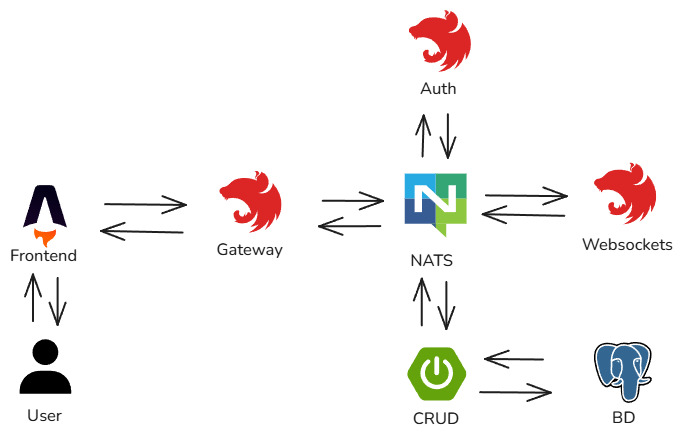

    

# Tabla de contenidos

- [Tabla de contenidos](#tabla-de-contenidos)
- [Contexto de Reservo y finalidad](#contexto-de-reservo-y-finalidad)
- [Reservo Gateway](#reservo-gateway-)
- [Configuración del entorno](#configuración-del-entorno-)
  - [Requisitos previos](#requisitos-previos)
  - [Inicializar el proyecto](#inicializar-el-proyecto)
- [Licencia](#licencia)

# Contexto de Reservo y finalidad

Reservo nace como un proyecto personal con **el objetivo de aprender y experimentar de primera mano los principios de la arquitectura de microservicios**, comprendiendo tanto sus ventajas como sus desafíos mientras desarrollaba una solución para gestionar las reservas de un auditorio.

Además, quería explorar una tecnología diferente al ecosistema de JavaScript para construir servidores web, por lo que decidí desarrollar el núcleo del proyecto en Java 17 con Spring Boot. Este camino me permitió adquirir nuevos conocimientos, afianzar buenas prácticas y diseñar un repositorio orientado a facilitar una experiencia de desarrollo limpia y mantenible.

Reconozco que la distribución de responsabilidades entre los distintos microservicios pudo haber sido más simple. Sin embargo, quise retarme simulando un entorno más complejo, donde fuera necesario orquestar múltiples servicios al mismo tiempo. Esta decisión, aunque desafiante, me permitió entender mejor las implicaciones reales de trabajar con este tipo de arquitectura en contextos más amplios.

Reservo está compuesto por cinco repositorios:

- [Fronted desarrollado en Astro y React 🚀](https://github.com/Hector-f-Romero/reservo-front)
- [Gateway de NestJS encargado de enrutar las peticiones al microservicio correspondiente 🧠](https://github.com/Hector-f-Romero/reservo-api-gateway)
- [Microservicio en Spring Boot que gestiona el CRUD de las entidades involucradas 🎨](https://github.com/Hector-f-Romero/reservo-events-user-ms)
- [App híbrida de NestJS que utiliza WebSockets y se comunica entre microservicios ⌚](https://github.com/Hector-f-Romero/reservo-ws-ms)
- [Microservicio de NestJS dedicado a la autenticación 🔐](https://github.com/Hector-f-Romero/reservo-auth-ms)

En cada repositorio he documentado los principales retos enfrentados y los aprendizajes obtenidos durante el desarrollo. Mirando hacia atrás, solo puedo sentirme orgulloso del esfuerzo invertido y del resultado alcanzado con este proyecto.

# Reservo Gateway 🧠

Este proyecto es un API Gateway desarrollado con NestJS que actúa como punto de entrada centralizado para todo el ecosistema de Resevo. En sus funciones principales se encuentran:

- Actúa como intermediario entre el frontend y los distintos microservicios.
- Gestiona la autenticación mediante JWT almacenados en cookies.
- Centraliza el manejo de errores de los microservicios.
- Se comunica con los microservicios mediante NATS (message broker).
- Proporciona una API REST documentada con Swagger.

Se escogió NATS como message broker debido a su simplicidad y despliegue sencillo mediante Docker, permitiendo enfocarme en la lógica de negocio sin tener que configurar de forma compleja este intermediario. El proyecto incluye un archivo `docker-compose` para levantar el servidor de NATS antes de ejecutar el gateway.

Uno de los principales retos en este repositorio fue estandarizar el manejo de respuestas entre microservicios. Para ello, desarrollé una clase llamada `NatsClientWrapper`, que establece una única conexión con el broker y centraliza el procesamiento de respuestas, evaluando cada mensaje según su atributo `code`.

# Configuración del entorno ⚙

## Requisitos previos 
- Node 22.12.0
- Docker Desktop
- pnpm 10.8.0

## Inicializar el proyecto

1. Clonar este repositorio y accede al directorio del proyecto.
2. Instalar dependencias usando el gestor de paquetes: `pnpm install`.
3. Crear el archivo de variables de entorno `cp .env.example .env`.
4. Completar los valores necesarios dentro del archivo `.env`.
5. Levantar servidor de NATS usando `docker-compose up -d`.
6. Iniciar el servidor Gateway usando el comando `pnpm run start:dev`.
7. Asegurarse de tener los siguientes servicios en ejecución:
   - Reservo Auth MS
   - Reservo Events User MS
   - Reservo WebSocket MS.
8. Ejecuta una petición `HTTP POST` al endpoint `/V1/seed` para cargar datos de prueba en la base de datos.

Por defecto, la documentación de la API está disponible en `http://localhost:3000/api` .

# Licencia

Revisa `LICENSE` para más información.